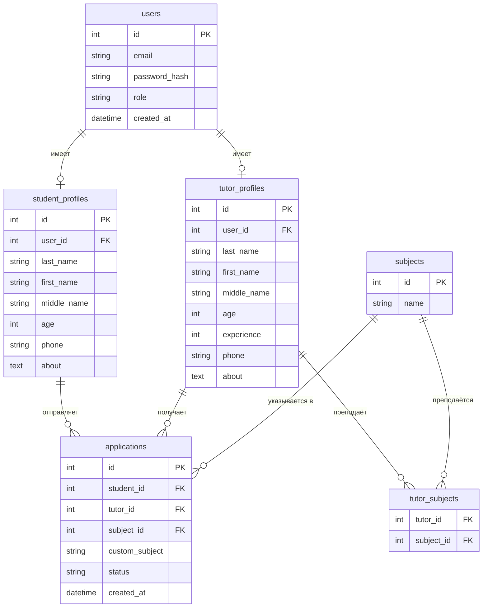
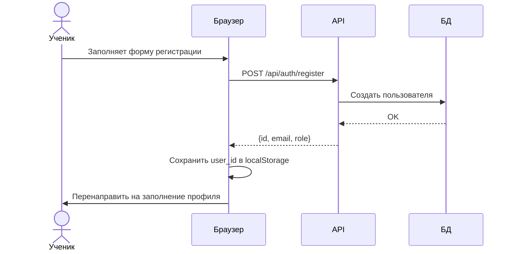
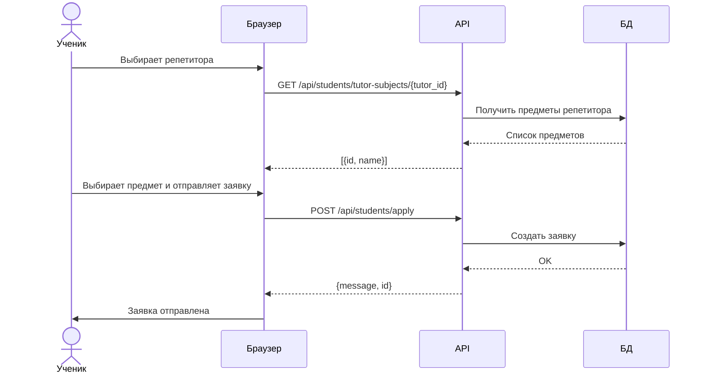
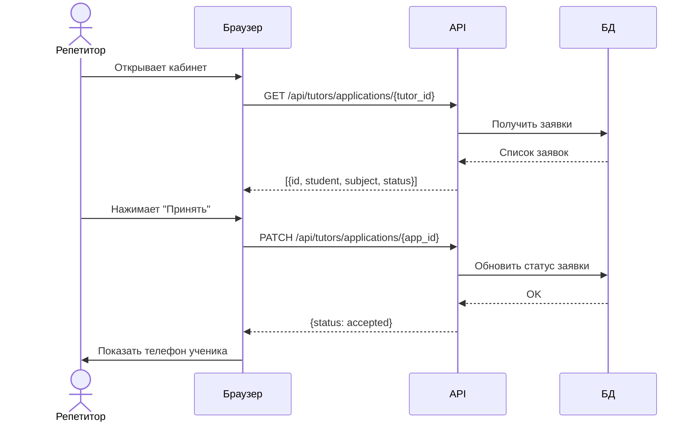

# tutor-finder-docs

Документация web-приложения для онлайн-подбора репетиторов

TutorFinder — web-приложение для онлайн-подбора репетиторов, ориентированное на школьников и студентов, с функциями специально адаптированными под учебный процесс: подбор репетиторов, фильтрация по предметам, отправка заявок, управление заявками.

## Функции приложения

- Регистрация и вход в аккаунт
- Два типа пользователей — ученик и репетитор
- Заполнение профиля с личными данными
- Поиск репетиторов с фильтрацией по предметам
- Отправка заявки репетитору с указанием предмета
- Принятие и отклонение заявок репетитором
- Обмен контактами после принятия заявки
- Редактирование профиля с подтверждением паролем
- Обращение в техподдержку с отправкой письма на почту

Приложение реализуется с использованием клиент-серверной архитектуры:

- Клиентская часть — web-приложение на HTML + JavaScript, репозиторий [tutor-finder-front](https://github.com/Chirkov-Arhip/tutor-finder-front).
- Серверная часть — REST API, написанное на Python с использованием FastAPI, репозиторий [tutor-finder-api](https://github.com/Chirkov-Arhip/tutor-finder-api).

## Оглавление

- [Архитектура приложения](#архитектура-приложения)
- [Схема базы данных](#схема-базы-данных)
- [Диаграммы](#диаграммы)
- [Работа с диаграммами](#работа-с-диаграммами)

## Архитектура приложения

Приложение построено по клиент-серверной архитектуре:

```
Браузер (HTML + JavaScript)
        ↕ HTTP запросы (JSON)
FastAPI сервер (Python)
        ↕ SQLAlchemy ORM
PostgreSQL база данных
```

**Клиентская часть** отвечает за отображение интерфейса и отправку запросов к API. Вся логика взаимодействия с сервером реализована через Fetch API в JavaScript.

**Серверная часть** обрабатывает запросы, работает с базой данных и возвращает данные в формате JSON.

## Схема базы данных

Приложение использует следующие таблицы:

- **users** — все пользователи системы (email, пароль, роль)
- **student_profiles** — профили учеников (ФИО, возраст, телефон, о себе)
- **tutor_profiles** — профили репетиторов (ФИО, возраст, опыт, телефон, о себе)
- **subjects** — справочник предметов
- **tutor_subjects** — связь репетиторов и предметов (многие-ко-многим)
- **applications** — заявки от учеников к репетиторам

## Диаграммы

Диаграммы проекта созданы с использованием библиотеки [Mermaid](https://mermaid.js.org/).

### Диаграмма базы данных



### Диаграмма последовательности — регистрация ученика



### Диаграмма последовательности — отправка заявки



### Диаграмма последовательности — принятие заявки



## Работа с диаграммами

Для разработки диаграмм можно использовать библиотеку [Mermaid](https://mermaid.js.org/) и [онлайн-редактор диаграмм](https://mermaid.live/edit).

Для работы с диаграммами в VS Code рекомендуется установить расширения:

- **Markdown Preview Mermaid Support** — предпросмотр диаграмм в Markdown
- **Code Spell Checker** — проверка орфографии
- **Russian - Code Spell Checker** — проверка орфографии на русском языке
