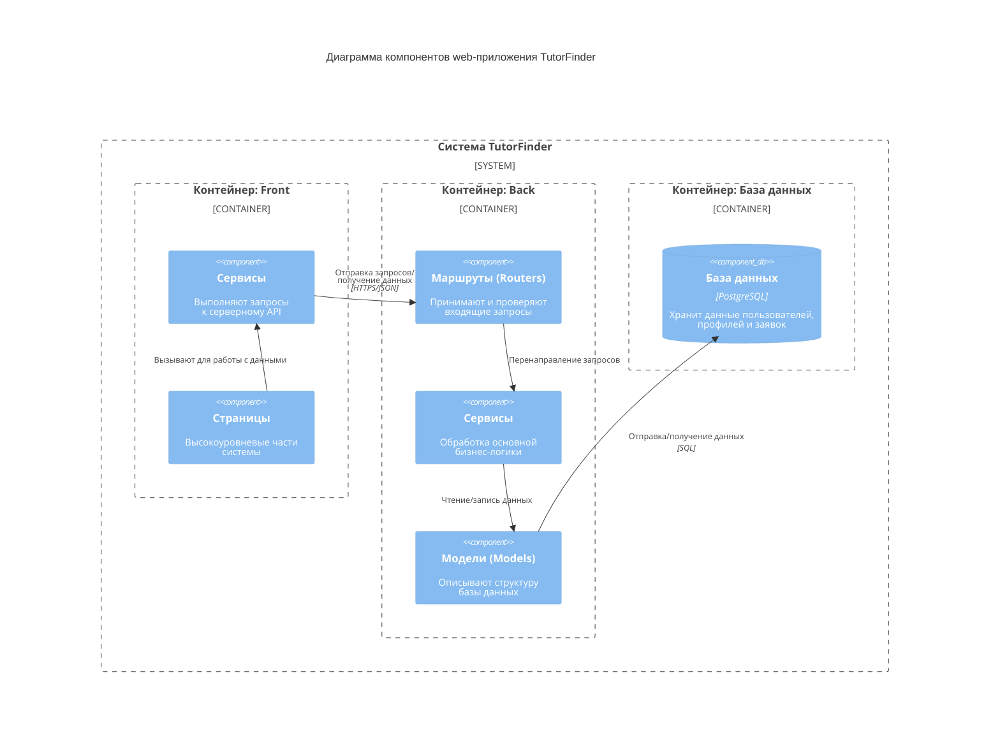

# Диаграмма компонентов
Диаграмма компонентов показывает внутреннюю структуру контейнера, разбивая его на логические компоненты и связи между ними.

## Описание диаграммы

Диаграмма отображает внутреннюю структуру системы на уровне компонентов. Система разделена на три основных контейнера:

1. **Контейнер Front** включает:
   - **Страницы** — HTML страницы интерфейса (главная, регистрация, поиск репетиторов, профиль, техподдержка)
   - **Сервисы** — JavaScript файлы, обеспечивающие связь фронтенда с бэкендом через Fetch API

2. **Контейнер Back** включает:
   - **Маршруты (Routers)** — принимают HTTP запросы, проверяют данные через Pydantic схемы
   - **Сервисы** — обрабатывают бизнес-логику (регистрация, поиск, заявки, почта)
   - **Модели (Models)** — SQLAlchemy модели, описывающие структуру таблиц базы данных

3. **Контейнер базы данных:**
   - **PostgreSQL** — хранит данные о пользователях, профилях учеников и репетиторов, предметах и заявках

## Ключевые взаимодействия

- Страницы вызывают сервисы фронтенда для получения и отправки данных.
- Сервисы фронтенда отправляют HTTP запросы к маршрутам бэкенда.
- Маршруты передают запросы в сервисы бэкенда для обработки.
- Сервисы бэкенда работают с моделями для чтения и записи данных в БД.
