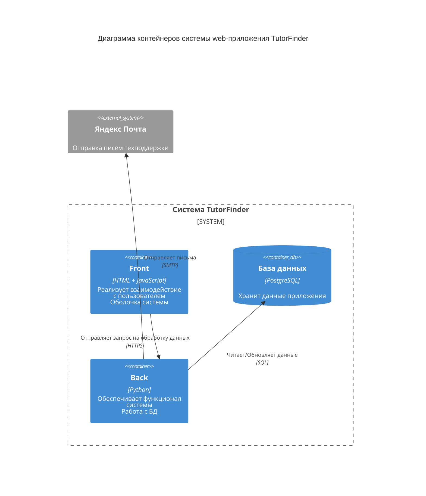

# Диаграмма контейнеров
Диаграмма контейнеров C4 показывает высокоуровневую архитектуру системы, выделяя основные подсистемы внутри границ рассматриваемой системы и их взаимодействие.

## Описание контейнеров

1. **Front (HTML + JavaScript):**
   - Отображение интерфейса для учеников и репетиторов.
   - Регистрация, вход, заполнение профиля.
   - Поиск репетиторов с фильтрацией по предметам.
   - Отправка заявок и управление ими.

2. **Back (Python / FastAPI):**
   - Обработка запросов от клиентской части.
   - Реализация бизнес-логики приложения.
   - Работа с базой данных через SQLAlchemy.
   - Отправка писем через SMTP.

3. **База данных (PostgreSQL):**
   - Хранит данные о пользователях, профилях, предметах и заявках.

## Внешние системы

1. **Яндекс Почта** — используется для отправки писем при обращении пользователей в техподдержку.
