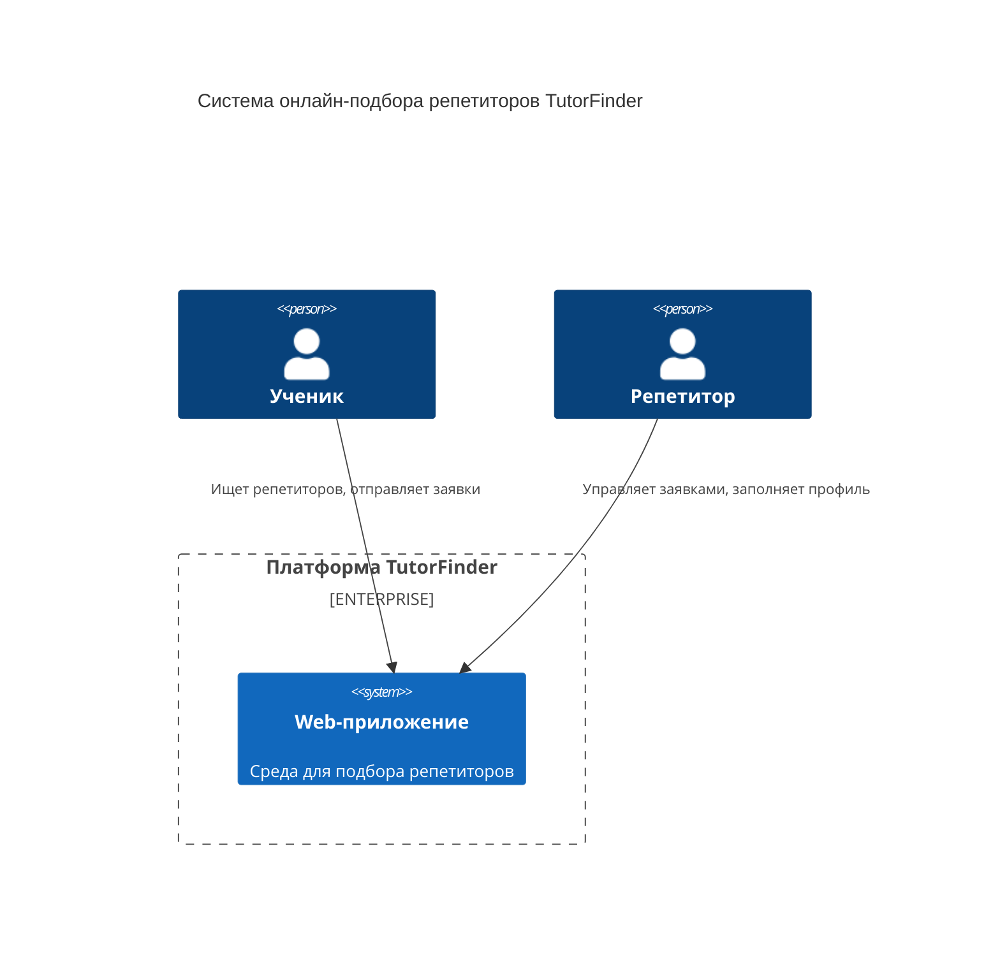

# Диаграмма контекста
Диаграмма показывает систему в масштабе её взаимодействия с пользователями и другими системами.

## Описание компонентов

1. **Ученик.** Пользователь, который ищет репетитора по нужному предмету, отправляет заявки и получает контакты принявшего репетитора.
2. **Репетитор.** Пользователь, который размещает информацию о себе и предметах, управляет входящими заявками от учеников.
3. **Web-приложение.** Платформа для онлайн-подбора репетиторов, обеспечивающая пользователей всем необходимым функционалом.

## Описание взаимодействий

1. Ученик регистрируется, заполняет профиль, ищет репетиторов по предметам и отправляет им заявки.
2. Репетитор регистрируется, заполняет профиль с указанием предметов, принимает или отклоняет входящие заявки.
3. После принятия заявки оба пользователя получают контактные данные друг друга.
